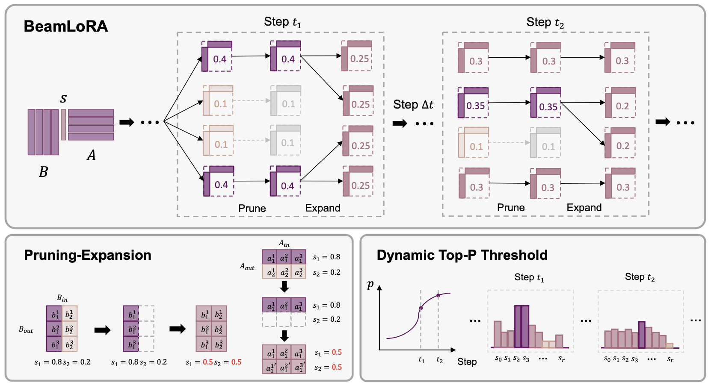

# BeamLoRA
Here is the implementation of our ACL2025 paper "[BeamLoRA: Beam-Constraint Low-Rank Adaptation](https://arxiv.org/abs/2502.13604)".

## Setup

```bash
## Training Environment (beamlora)
pip install -r requirements-train.txt
cd peft
pip install -e .
cd ../transformers
pip install -e .

## Inference Environment (math_infer)
pip install -r requirements-infer.txt
cd peft
pip install -e .
```

## Run Experiments

```bash
bash ./ft_scripts/ft_beamlora.sh
```

Note: For training with a learning rate less than 1e-4 (i.e. Mistral-7B experiments), you need to adjust the softmax temperature as follows:

```bash
1. In peft/src/peft/tuners/lora/layer.py at line 519:
change self.temperature to 0.03 (default is 0.05).
2. In peft/src/peft/tuners/lora/model.py at line 810:
change temperature to 0.03 (default is 0.05).
```

## Citation
```
@misc{gu2025beamlorabeamconstraintlowrankadaptation,
      title={BeamLoRA: Beam-Constraint Low-Rank Adaptation}, 
      author={Naibin Gu and Zhenyu Zhang and Xiyu Liu and Peng Fu and Zheng Lin and Shuohuan Wang and Yu Sun and Hua Wu and Weiping Wang and Haifeng Wang},
      year={2025},
      eprint={2502.13604},
      archivePrefix={arXiv},
      primaryClass={cs.CL},
      url={https://arxiv.org/abs/2502.13604}, 
}
```

## Acknowledgement
This repo benefits from [PEFT](https://github.com/huggingface/peft), [LLM-Adapters](https://github.com/AGI-Edgerunners/LLM-Adapters), [MoRA](https://github.com/kongds/MoRA), [ReLoRA](https://github.com/Guitaricet/relora), and [PiSSA](https://github.com/GraphPKU/PiSSA). Thanks to their great work!
